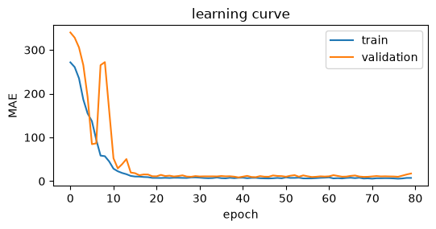
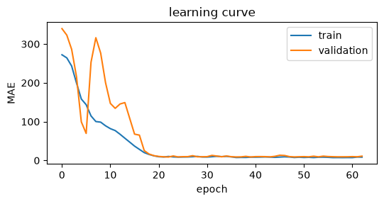

## Part 1: Classical forecasting by hand

Demand: Jan 8, Feb 9, Mar 14, Apr 17, May 18, Jun 16 (t = 1 to 6).

A one-step forecast for month t+1 is made at the end of month t, and a two-step forecast for month t+2 is made at the end of month t. So for April the one-step forecast uses data through March (t = 3) and the two-step forecast uses data through February (t = 2).

### 1. Forecasts

**(a) Moving average, m = 2.** f(t+τ) = (A~t~ + A~t−1~)/2 for any τ.

| End of month | MA |
|---|---|
| Feb (t=2) | (9 + 8)/2 = 8.5 |
| Mar (t=3) | (14 + 9)/2 = 11.5 |
| Apr (t=4) | (17 + 14)/2 = 15.5 |
| May (t=5) | (18 + 17)/2 = 17.5 |

| Month | A~t~ | One-step | Two-step |
|---|---|---|---|
| Apr | 17 | 11.5 | 8.5 |
| May | 18 | 15.5 | 11.5 |
| Jun | 16 | 17.5 | 15.5 |

**(b) Exponential smoothing, α = 0.2, F~1~ = 8.** F~t~ = αA~t~ + (1 − α)F~t−1~, f(t+τ) = F~t~.

| t | A~t~ | Calculation | F~t~ |
|---|---|---|---|
| 1 | 8 | given | 8.0000 |
| 2 | 9 | 0.2(9) + 0.8(8) | 8.2000 |
| 3 | 14 | 0.2(14) + 0.8(8.2) | 9.3600 |
| 4 | 17 | 0.2(17) + 0.8(9.36) | 10.8880 |
| 5 | 18 | 0.2(18) + 0.8(10.888) | 12.3104 |

| Month | A~t~ | One-step | Two-step |
|---|---|---|---|
| Apr | 17 | F~3~ = 9.3600 | F~2~ = 8.2000 |
| May | 18 | F~4~ = 10.8880 | F~3~ = 9.3600 |
| Jun | 16 | F~5~ = 12.3104 | F~4~ = 10.8880 |

**(c) Double exponential smoothing, α = β = 0.2, F~1~ = 8, T~1~ = 0.**
F~t~ = αA~t~ + (1 − α)(F~t−1~ + T~t−1~), T~t~ = β(F~t~ − F~t−1~) + (1 − β)T~t−1~, f(t+τ) = F~t~ + τT~t~.

| t | A~t~ | F~t~ | T~t~ |
|---|---|---|---|
| 1 | 8 | 8 | 0 |
| 2 | 9 | 0.2(9) + 0.8(8 + 0) = 8.2000 | 0.2(0.2) + 0.8(0) = 0.0400 |
| 3 | 14 | 0.2(14) + 0.8(8.24) = 9.3920 | 0.2(1.192) + 0.8(0.04) = 0.2704 |
| 4 | 17 | 0.2(17) + 0.8(9.6624) = 11.1299 | 0.2(1.7379) + 0.8(0.2704) = 0.5639 |
| 5 | 18 | 0.2(18) + 0.8(11.6938) = 12.9551 | 0.2(1.8251) + 0.8(0.5639) = 0.8162 |

| Month | A~t~ | One-step (F~t~ + T~t~) | Two-step (F~t~ + 2T~t~) |
|---|---|---|---|
| Apr | 17 | 9.3920 + 0.2704 = 9.6624 | 8.2000 + 0.0800 = 8.2800 |
| May | 18 | 11.1299 + 0.5639 = 11.6938 | 9.3920 + 0.5408 = 9.9328 |
| Jun | 16 | 12.9551 + 0.8162 = 13.7712 | 11.1299 + 1.1278 = 12.2577 |

### 2. Accuracy (April to June, n = 3)

Error ε~t~ = f~t~ − A~t~. MAD = Σ|ε|/n, MSD = Σε²/n, MAPE = (1/n)Σ(|ε|/A) × 100.

| Series | ε Apr | ε May | ε Jun | MAD | MSD | MAPE |
|---|---|---|---|---|---|---|
| MA, one-step | −5.50 | −2.50 | +1.50 | **3.167** | **12.917** | **18.54%** |
| ES, one-step | −7.64 | −7.11 | −3.69 | 6.147 | 40.854 | 35.84% |
| DES, one-step | −7.34 | −6.31 | −2.23 | 5.291 | 32.859 | 30.71% |
| MA, two-step | −8.50 | −6.50 | −0.50 | **5.167** | **38.250** | **29.75%** |
| ES, two-step | −8.80 | −8.64 | −5.11 | 7.517 | 59.407 | 43.90% |
| DES, two-step | −8.72 | −8.07 | −3.74 | 6.843 | 51.708 | 39.83% |

Example (MA one-step): MAD = (5.5 + 2.5 + 1.5)/3 = 3.167; MSD = (30.25 + 6.25 + 2.25)/3 = 12.917; MAPE = (32.35 + 13.89 + 9.38)/3 = 18.54%.

**Comparison.** MA(2) is best on MAD, MSD and MAPE at both horizons, DES is second and ES is last, and the ranking is the same for one-step and two-step (all errors just get bigger at two steps). Demand rises quickly from 8 to 18, so every method lags and nearly all errors are negative. MA(2) only averages the last two months, so it has the least smoothing and the smallest lag. ES with α = 0.2 smooths heavily and starts from F~1~ = 8, so it falls far behind the rising data. DES adds a trend term that reduces this lag, but with β = 0.2 and T~1~ = 0 the trend builds up too slowly (T~4~ ≈ 0.56 vs. an actual rise of about 3 units/month) to catch MA.

## Part 2: Notebook

Submitted separately as `Dutta_Prajjwal_A1.ipynb`. All five CHECK cells pass and all cells are run with outputs.

## Part 3: Scorecard and interpretation

### 1. Scorecard (46 held-out months, Mar 2021 to Dec 2024)

| Forecast | MAD (units) | MAPE |
|---|---|---|
| Naive (last month, lag_1) | 30.57 | 8.40% |
| Seasonal naive (same month last year, lag_12) | 11.20 | 2.91% |
| Network from scratch (Cell 13) | 13.58 | 3.57% |
| Baseline + network (Cell 18) | 9.06 | 2.42% |

### 2. Interpretation

On the 46 held-out months, the network trained from scratch has a MAPE of about 3.6% (MAD 13.6 units). That is about 0.7 percentage points worse than the seasonal naive (2.9%) and less than half the naive error (8.4%). So on its own the network does not beat the free seasonal baseline. When the network is trained to correct the seasonal naive instead, the MAPE drops to about 2.4% (MAD 9.1), roughly 19% below the seasonal naive and under a third of the naive error. I would hand planning the baseline + network forecast. It is the only one that beats the best simple baseline on unseen months, and since it is anchored to last year's same month it stays at the right level as demand grows.

### 3. Discussion questions

**(a)** The series is trend plus a stable yearly seasonal pattern plus noise, and the seasonal shape repeats almost unchanged every year. Seasonal naive assumes exactly this ("this month = same month last year"), so its only real error is one year of trend growth (about 10 units, its mean bias on the test set is −9.8) plus noise.

**(b)** The network trained from scratch suffers. Training demand averages about 288 while test demand averages about 385, so the network has to extrapolate outside the input range it was trained on, and a ReLU network just continues its last linear piece there with no guarantee it is right (in my run it over-forecast most of 2024, by up to about 40 units). The naive methods copy actual recent values, so they move up with the level automatically.

**(c)** No. There are 5,825 trainable weights and only about 145 of the 182 rows are actually used to fit them (20% goes to validation), which is about 0.03 rows per weight. The weights are far from pinned down, so the network can easily fit noise, which is why early stopping is needed and why results change from seed to seed.

## Part 4: Controlled experiment

**What I changed:** `use_month`, lab value `True` → new value `False` (the 12 month one-hot inputs are removed, the network sees only the 12 lags).

**Results (46 held-out months, seed = 510)**

| | Lab configuration | use_month = False |
|---|---|---|
| Network MAD | 14.40 | **8.77** |
| Network MAPE | 3.86% | **2.31%** |
| Naive MAD / MAPE | 30.57 / 8.40% | 30.57 / 8.40% |
| Seasonal naive MAD / MAPE | 11.20 / 2.91% | 11.20 / 2.91% |
| Inputs / trainable weights | 24 / 5,825 | 12 / 5,057 |
| Epochs run | 80 | 63 |

{width=49%} {width=49%}

*Learning curves from Cell 19/20. Left: lab configuration. Right: use_month = False (my run).*

**Explanation.** Removing the month switches helped. The network MAD went from 14.4 to 8.8 units, and it now beats the seasonal naive (11.2) without the residual trick. The reason is that the twelve lags already carry the seasonal information. lag_12 is the same month last year, and the shape of the 12-month window tells the network where it is in the cycle (for example, a window ending with the Nov–Dec peak can only be followed by January). So the month switches are redundant inputs, and they cost weights: the first layer goes from 24×64 + 64 = 1,600 to 12×64 + 64 = 832 weights, for 5,057 trainable weights instead of 5,825. With only about 145 training rows, fewer weights means less room to fit noise. There is also a level effect. A month switch lets the network learn a fixed offset per month (e.g. "December is +X units") tuned to the training-period level. That offset does not grow when demand moves up to the test level, while seasonality read from the lags scales with the level, so it extrapolates better into the higher test period.

**Reliability check.** With seed = 1 the conclusion held: the network MAD was 8.48 (2.26%) without month switches vs. 14.05 (3.70%) for the lab configuration with the same seed.

## Part 5: Theory

### 1. Forward pass

x = (0.8, 1.4), W^(1)^ = [0.2 −0.4; 0.3 0.5], b^(1)^ = (0.1, 0.2), W^(2)^ = [0.8 0.5], b^(2)^ = 0.4.

z~1~ = 0.2(0.8) − 0.4(1.4) + 0.1 = 0.16 − 0.56 + 0.10 = **−0.30**

z~2~ = 0.3(0.8) + 0.5(1.4) + 0.2 = 0.24 + 0.70 + 0.20 = **1.14**

h~1~ = max(0, −0.30) = **0**, h~2~ = max(0, 1.14) = **1.14**

ŷ = 0.8(0) + 0.5(1.14) + 0.4 = **0.97**, so the forecast is 0.97 × 100 = **97 units**.

Hidden unit 1 switches off. Unit 1 is only active where 0.2x~1~ − 0.4x~2~ + 0.1 > 0, i.e. x~2~ < 0.5x~1~ + 0.25. Here x~2~ = 1.4 is above 0.5(0.8) + 0.25 = 0.65, so the input falls in the region where unit 1 is off. Each ReLU unit splits the input space with a line, and in this region the network is just one linear function using unit 2 only: ŷ = 0.15x~1~ + 0.25x~2~ + 0.5. Inputs on the other side of the line (x~2~ < 0.5x~1~ + 0.25) turn unit 1 on and get a different linear piece. This is how a ReLU network builds a piecewise-linear forecast.

### 2. Pseudocode, one epoch of mini-batch gradient descent (MAE loss)

```
ONE_EPOCH(rows (x_k, y_k) k = 1..K, weights W, learning rate η, batch size B)
1  shuffle the row indices 1..K
2  split them into batches of B rows (last batch may be smaller)
3  for each batch S:
4      for each k in S: ŷ_k = f(x_k; W)            # forward pass
5      J = (1/|S|) Σ_{k in S} |ŷ_k − y_k|          # MAE loss on the batch
6      g = ∇_W J                                   # gradient by backpropagation
7      W = W − η·g                                 # weight update
8  return W
```

### 3. Short answer

A forecast is always made from the past about the future, so the test set has to be the most recent months to copy that situation: train on months before the cut-off, score on months after it. With a random 20% split the test months sit between training months, their lag windows overlap with training labels, and the demand level around them is already known. The test score would then measure how well the model interpolates inside history it has already seen (close to in-sample fit), not how well it forecasts an unseen future, so it would look too optimistic.
