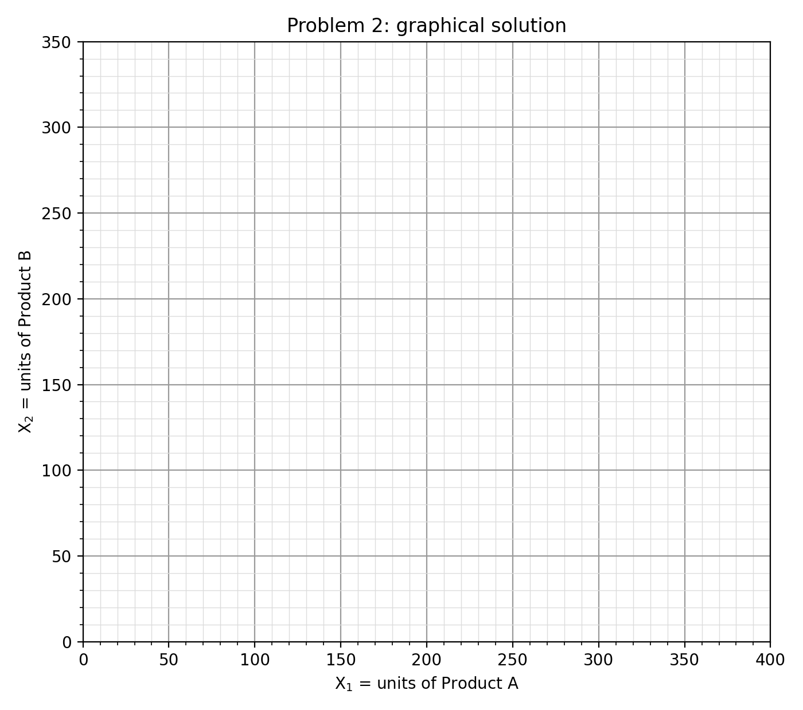
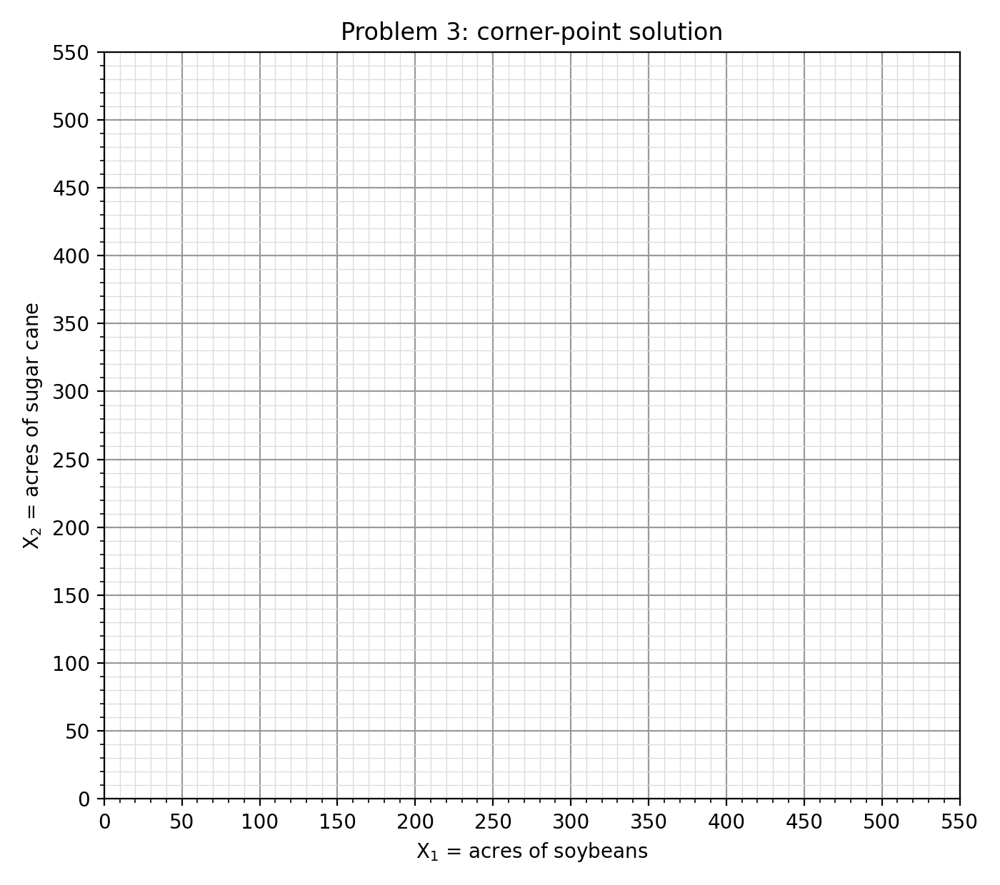

## Problem 1: Triple exponential smoothing

Sales: A~1~ = 40, A~2~ = 50, A~3~ = 60, A~4~ = 50, A~5~ = 44. α = β = γ = 0.2, N = 4.

F~t~ = αA~t~/c~t−N~ + (1 − α)(F~t−1~ + T~t−1~), T~t~ = β(F~t~ − F~t−1~) + (1 − β)T~t−1~, c~t~ = γA~t~/F~t~ + (1 − γ)c~t−N~, f(t+τ) = (F~t~ + τT~t~)·c~t+τ−N~.

### (a) Initialization on the first year

F~4~ = (40 + 50 + 60 + 50)/4 = 200/4 = **50.0000**

T~4~ = **0**

| i | A~i~ | c~i~ = A~i~/F~4~ |
|---|---|---|
| 1 | 40 | 40/50 = **0.8000** |
| 2 | 50 | 50/50 = **1.0000** |
| 3 | 60 | 60/50 = **1.2000** |
| 4 | 50 | 50/50 = **1.0000** |

Check: the four factors add up to N = 4 (0.8 + 1.0 + 1.2 + 1.0 = 4.0).

### (b) First forecast and its error

The forecast for t = 5 is made at the end of t = 4 with τ = 1, so it uses c~5−4~ = c~1~ (the Q1 factor):

f~5~ = (F~4~ + 1·T~4~)·c~1~ = (50 + 0)(0.8000) = **40.0000**

ε~5~ = f~5~ − A~5~ = 40 − 44 = **−4.0000** (the forecast was 4 thousand units too low).

### (c) Update with A~5~ = 44

F~5~ = αA~5~/c~1~ + (1 − α)(F~4~ + T~4~) = 0.2(44/0.8000) + 0.8(50 + 0) = 0.2(55) + 40 = 11 + 40 = **51.0000**

T~5~ = β(F~5~ − F~4~) + (1 − β)T~4~ = 0.2(51 − 50) + 0.8(0) = **0.2000**

c~5~ = γA~5~/F~5~ + (1 − γ)c~1~ = 0.2(44/51) + 0.8(0.8000) = 0.2(0.8627) + 0.6400 = 0.1725 + 0.6400 = **0.8125**

c~5~ is the updated Q1 factor. It replaces c~1~ and will be used for the next Q1 forecast (t = 9).

### (d) Forecasts made at the end of t = 5

f~6~ = (F~5~ + 1·T~5~)·c~6−4~ = (51 + 0.2)·c~2~ = 51.2(1.0000) = **51.2000**

f~7~ = (F~5~ + 2·T~5~)·c~7−4~ = (51 + 0.4)·c~3~ = 51.4(1.2000) = **61.6800**

**Which factors and why.** t = 6 is Q2 of year 2, and t = 7 is Q3 of year 2. The seasonal factor must match the quarter being forecast, so each forecast uses the most recent factor for that same quarter, which is the one from exactly one season (N = 4 periods) earlier: c~2~ for Q2 and c~3~ for Q3. The new factor c~5~ belongs to Q1 and cannot be used for Q2 or Q3.

## Problem 2: Product mix by the graphical method

### (a) Formulation

X~1~ = units of Product A made per week, X~2~ = units of Product B made per week.

Maximize Z = 1.5X~1~ + 1.5X~2~

subject to

| Constraint | Expression |
|---|---|
| Molding | 3X~1~ + 2X~2~ ≤ 600 |
| Painting | 2X~1~ + 4X~2~ ≤ 720 |
| Packing | 2X~1~ + 3X~2~ ≤ 480 |
| Nonnegativity | X~1~, X~2~ ≥ 0 |

### (b) Feasible region

Axis intercepts of each constraint line (set the other variable to 0):

| Line | X~1~ intercept | X~2~ intercept |
|---|---|---|
| Molding 3X~1~ + 2X~2~ = 600 | 600/3 = 200 | 600/2 = 300 |
| Painting 2X~1~ + 4X~2~ = 720 | 720/2 = 360 | 720/4 = 180 |
| Packing 2X~1~ + 3X~2~ = 480 | 480/2 = 240 | 480/3 = 160 |

On the X~1~ axis the tightest limit is molding (200). On the X~2~ axis it is packing (160). The remaining corner is where molding and packing cross:

3X~1~ + 2X~2~ = 600 (×3) → 9X~1~ + 6X~2~ = 1800

2X~1~ + 3X~2~ = 480 (×2) → 4X~1~ + 6X~2~ = 960

Subtract: 5X~1~ = 840 → X~1~ = 168, X~2~ = (600 − 3·168)/2 = (600 − 504)/2 = 48.

Check painting at (168, 48): 2(168) + 4(48) = 528 ≤ 720, so the point is feasible.

Corner points: **(0, 0), (200, 0), (168, 48), (0, 160)**.

{width=85%}

### (c) Iso-profit line and optimum

Chosen profit $150: 1.5X~1~ + 1.5X~2~ = 150, i.e. X~1~ + X~2~ = 100 (dashed line, slope −1). Moving this line parallel to itself away from the origin, it last touches the feasible region at (168, 48). That happens because the iso-profit slope (−1) lies between the molding slope (−3/2) and the packing slope (−2/3). At that point the line is X~1~ + X~2~ = 216, so Z = 1.5(216) = $324.

Corner check: Z(0, 0) = $0, Z(200, 0) = $300, **Z(168, 48) = $324**, Z(0, 160) = $240.

**Optimal mix: 168 units of A and 48 units of B per week, for a maximum weekly contribution of $324.**

| Resource | Used at optimum | Available | Slack | Binding? |
|---|---|---|---|---|
| Molding | 3(168) + 2(48) = 600 | 600 | 0 | Yes |
| Painting | 2(168) + 4(48) = 528 | 720 | 192 | **No** |
| Packing | 2(168) + 3(48) = 480 | 480 | 0 | Yes |

**Painting is never binding.** Its line (intercepts 360 and 180) lies completely outside the feasible region. The most painting any feasible mix can use is 2(0) + 4(160) = 640 minutes at (0, 160), so there are always at least 80 idle painting minutes, and 192 idle minutes at the optimum. For the manager, this means extra painting capacity is worth $0: adding painting hours, overtime or equipment would not raise profit, and the 192 spare minutes could go to other work. Molding and packing are the bottlenecks, and any capacity investment should go there.

## Problem 3: Rienzi Farms by the corner-point method

### (a) Formulation

X~1~ = acres of soybeans, X~2~ = acres of sugar cane.

Maximize Z = 1,000X~1~ + 2,500X~2~

subject to

| Constraint | Expression |
|---|---|
| Land | X~1~ + X~2~ ≤ 500 |
| Soybean program limit | X~1~ ≤ 150 |
| Planting time | 2X~1~ + 6X~2~ ≤ 1,800 |
| Nonnegativity | X~1~, X~2~ ≥ 0 |

### (b) Corner-point method

Planting-time line intercepts: X~1~ = 1800/2 = 900, X~2~ = 1800/6 = 300. Land line intercepts: 500 and 500.

The land line and the planting line would cross at X~1~ + X~2~ = 500 and 2X~1~ + 6X~2~ = 1800. Subtracting 2×(land) from planting gives 4X~2~ = 800, so X~2~ = 200 and X~1~ = 300. That violates X~1~ ≤ 150, so this crossing is not a corner of the feasible region, and **land never binds**.

{width=80%}

| Corner | Defining constraints | Calculation | Z |
|---|---|---|---|
| (0, 0) | X~1~ = 0, X~2~ = 0 | 0 + 0 | $0 |
| (150, 0) | X~1~ = 150, X~2~ = 0 | 1,000(150) + 0 | $150,000 |
| (150, 250) | X~1~ = 150, 2X~1~ + 6X~2~ = 1,800 → 6X~2~ = 1,500 | 1,000(150) + 2,500(250) | **$775,000** |
| (0, 300) | X~1~ = 0, 2X~1~ + 6X~2~ = 1,800 → X~2~ = 300 | 0 + 2,500(300) | $750,000 |

Feasibility check at (150, 250): land 150 + 250 = 400 ≤ 500, planting 2(150) + 6(250) = 1,800 ≤ 1,800.

**Optimal plan: 150 acres of soybeans and 250 acres of sugar cane, for a total profit of $775,000.**

**Unplanted land:** 500 − (150 + 250) = **100 acres**. Planting time (1,800 hours) and the soybean limit (150 acres) run out before the land does.

## Problem 4: Rollins Publishing

### (a) Formulation

Decision variables for books i = 1, …, 5:

- X~i~ = number of copies of book i printed (continuous, ≥ 0)
- Y~i~ = 1 if book i is published, 0 otherwise

Unit contribution S~i~ − V~i~: book 1: 40 − 19 = 21, book 2: 60 − 28 = 32, book 3: 52 − 30 = 22, book 4: 34 − 20 = 14, book 5: 45 − 20 = 25.

**Objective.** Maximize Z = Σ~i~ [(S~i~ − V~i~)X~i~ − F~i~Y~i~]

Maximize Z = 21X~1~ + 32X~2~ + 22X~3~ + 14X~4~ + 25X~5~ − 12,000Y~1~ − 21,000Y~2~ − 15,000Y~3~ − 10,000Y~4~ − 18,000Y~5~

subject to

| Constraint | Expression |
|---|---|
| Capacity | X~1~ + X~2~ + X~3~ + X~4~ + X~5~ ≤ 20,000 |
| Link / demand, book 1 | X~1~ ≤ 9,000Y~1~ |
| Link / demand, book 2 | X~2~ ≤ 8,000Y~2~ |
| Link / demand, book 3 | X~3~ ≤ 5,000Y~3~ |
| Link / demand, book 4 | X~4~ ≤ 6,000Y~4~ |
| Link / demand, book 5 | X~5~ ≤ 7,000Y~5~ |
| Domains | X~i~ ≥ 0, Y~i~ ∈ {0, 1} for i = 1, …, 5 |

The linking constraint X~i~ ≤ D~i~Y~i~ does two jobs. If Y~i~ = 0 it forces X~i~ = 0 (no copies without publishing). If Y~i~ = 1 it caps copies at the maximum demand D~i~ and charges the fixed cost F~i~ in the objective.

### (b) Spot the error

With X~i~ ≥ D~i~Y~i~, setting Y~i~ = 0 gives only X~i~ ≥ 0, so the model can print any number of copies without paying the fixed cost. Since the objective rewards Y~i~ = 0 (it removes −F~i~), the solver sets every Y~i~ = 0 and prints freely, for example 20,000 copies of book 2 for 32 × 20,000 = $640,000 with no fixed cost at all. Nothing caps the copies at the maximum demand either, and choosing Y~i~ = 1 would force at least D~i~ copies instead of at most D~i~. The link is reversed: it should be X~i~ ≤ D~i~Y~i~.

## Problem 5: Machine shop with downtime and defects

### Decision variables

X~A~ = units of Product A **started** per week, X~B~ = units of Product B **started** per week.

### (i) Downtime: available minutes per step

| Step | Downtime | Available minutes |
|---|---|---|
| Polishing | 5% | 2,400(1 − 0.05) = 2,280 |
| Drilling | 10% | 2,400(1 − 0.10) = 2,160 |
| Tapping | 20% | 2,400(1 − 0.20) = 1,920 |

### (ii) Defects: units reaching each step

Defective parts are scrapped after the step where they are found, so each step only processes the units that survived the earlier steps (α = 0.01, β = 0.05, γ = 0.05):

| Point in the line | Fraction of units started | Product A | Product B |
|---|---|---|---|
| Reach polishing | 1 | X~A~ | X~B~ |
| Reach drilling | (1 − α) = 0.99 | 0.99X~A~ | 0.99X~B~ |
| Reach tapping | (1 − α)(1 − β) = 0.99(0.95) = 0.9405 | 0.9405X~A~ | 0.9405X~B~ |
| Good units out | (1 − α)(1 − β)(1 − γ) = 0.9405(0.95) = 0.893475 | 0.893475X~A~ | 0.893475X~B~ |

### Capacity constraints (minutes per unit × units reaching the step ≤ available minutes)

Polishing: 5X~A~ + 2X~B~ ≤ 2,280

Drilling: 2(0.99)X~A~ + 5(0.99)X~B~ ≤ 2,160 → 1.98X~A~ + 4.95X~B~ ≤ 2,160

Tapping: 2(0.9405)X~A~ + 3(0.9405)X~B~ ≤ 1,920 → 1.881X~A~ + 2.8215X~B~ ≤ 1,920

### (iii) Objective: profit on good units only

Maximize Z = 5(0.893475)X~A~ + 3(0.893475)X~B~ = **4.467375X~A~ + 2.680425X~B~**

### Complete model

Maximize Z = 4.467375X~A~ + 2.680425X~B~

subject to

| Constraint | Expression |
|---|---|
| Polishing | 5X~A~ + 2X~B~ ≤ 2,280 |
| Drilling | 1.98X~A~ + 4.95X~B~ ≤ 2,160 |
| Tapping | 1.881X~A~ + 2.8215X~B~ ≤ 1,920 |
| Nonnegativity | X~A~, X~B~ ≥ 0 |
